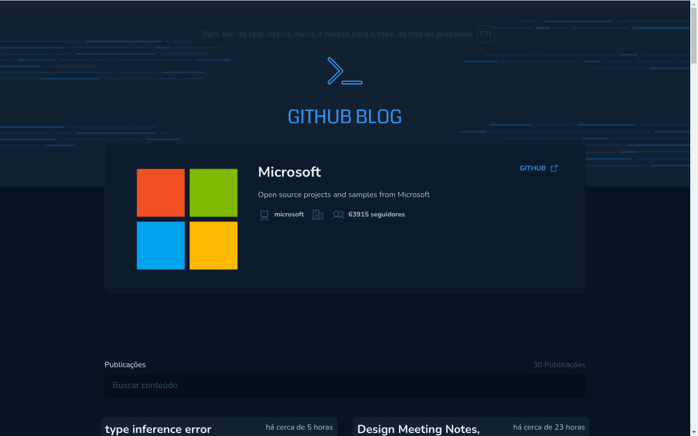

# GITHUB BLOG

## Aplicativo desenvolvido para criar um blog através de ISSUES no GITHUB.

Objetivo desse projeto: praticar a utilização de clientes HTTP para consumir dados de uma API

#### Funcionalidades:

- Listagem do seu perfil com imagem, número de seguidores, nome e outras informações disponíveis pela API do GitHub
- Listar e filtrar todas as issues do repositório com um pequeno resumo do conteúdo dela
- Criar uma página para exibir um post (issue) completo

Developer by: **Brenno C. Lins - BCL-LAB**

- [Link para testar o projeto - Github Blog](https://github-blog-bcl.netlify.app/)

## TECHS and LIBS
- [Vite](https://vitejs.dev/)
- [TailwindCSS](https://tailwindcss.com/)
- [React-router-dom](https://reactrouter.com/en/main)
- [Axios](https://axios-http.com/docs/intro)
- [Date-fns](https://date-fns.org/)
- [PhosPhor Icons](https://phosphoricons.com/)
- [React Markdown](https://github.com/remarkjs/react-markdown)
- [TypeScript](https://www.typescriptlang.org)
- [React JS](https://pt-br.react.dev/)
- [JavaScript](https://developer.mozilla.org/pt-BR/docs/web/javascript/guide/introduction)
<!-- - [react-hook-form](https://react-hook-form.com/) -->
<!-- - [@hookform/resovers](https://github.com/react-hook-form/resolvers) -->
<!-- - [zod](https://zod.dev/) -->

### CONTACT

- [Youtube](https://www.youtube.com/@bcllab)